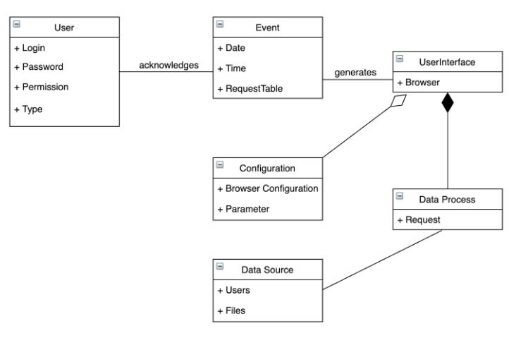
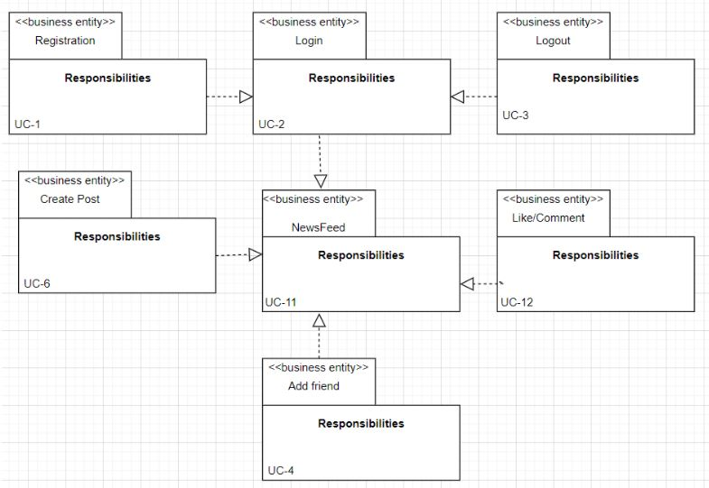
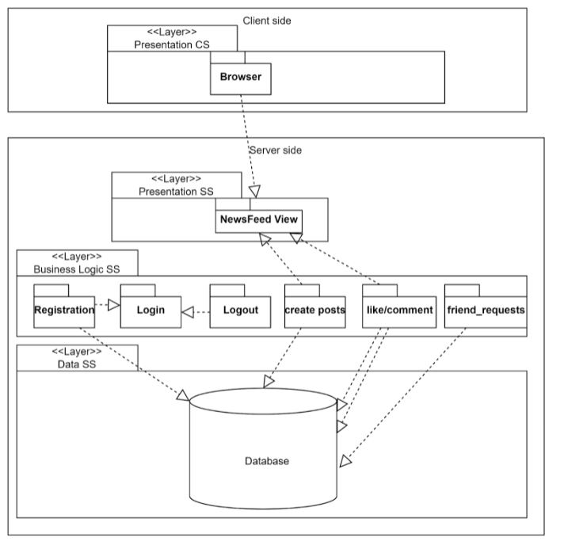
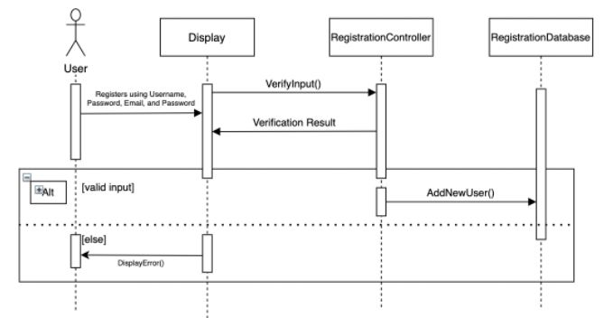
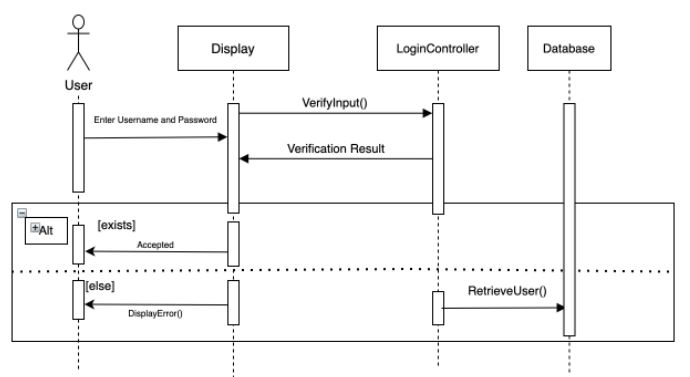
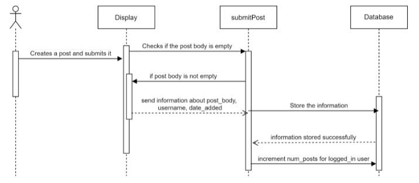

# Iteration 2: Identifying Structures to Support Primary Functionality

Here is the [full pdf](/Iterations/Iteration%202.pdf) of iteration 2 

The outcomes of the actions undertaken in each of the ADD phases in the second iteration of the design process for the LinkedHub system are shown in this section. We go from the general and coarse-grained functionality descriptions used in iteration 1 to more comprehensive decisions that will drive implementation and, as a result, the establishment of development teams in this iteration.

## Step 2: Establish Iteration Goal by Selecting Drivers
The primary use cases and concerns for this iteration are:
  1. UC - 1
  2. UC - 2
  3. UC - 6
  4. CRN - 3
 
## Step 3: Choose One or More Elements of the System to Refine
In this iteration, we will be refining the server side of the application. It's important for the system to support connecting to both client and the server easily. The modules which are required are located in the server since we are utilizing the web Web Application Architecture.

## Step 4: Choose One or More Design Concepts that Satisfy the Selected Drivers
| Design Design and Locations | Rationale and Assumptions |
| --------------------------- | ------------------------- |
| Create a domain model for the application | Before starting the functional decomposition, we need to create an initial domain model of the system that identifies the key entities in the domain and their relationships. There are no good options. Finally, it is necessary to build a domain model. Otherwise, it won't happen in an optimal way, resulting in specialized architectures that are difficult to understand and maintain. After a series of brainstorming sessions, we were able to create a domain model for our project using er diagrams and schema diagrams. |
| Identify Business Logic and map it to the use cases | In order to appropriately segregate concerns and specify data processing, use cases must be mapped to business logic. Alternatively, functional needs might be mapped to business entities, but certain requirements could be overlooked, or the business workflow could be riddled with duplication.|
| Decompose Business Logic into Business Entities | The entities for the business domain and their business logic are represented by combined business entities. Decomposing business logic into business entities has no viable alternatives.|
| Use Ajax and PHP | Ajax stands for Asynchronous Javascript and XML. AJAX is basically a technique which reloads certain contents of the page without actually reloading the entire page. Whereas on the other hand, PHP is a scripting language that stands for hypertext processor. We’d be using PHP for most of our client-side processing and to connect the business logic to the server. |

## Step 5: Instantiate Architectural Elements, Allocate Responsibilities and Define Interfaces
| Design decisions and Location | Rationale |
| ----------------------------- | ---------- |
| Create an initial domain model | We make an initial domain model and first prototype to better understand the working of the system in our primary use cases (CRN-3) | 
| Map modules based on Use Case model | Taking reference from the use case model, a finally business logic model is created after defining the business entities.| 
| Create a component diagram to map modules to the workflow | Modules that support the primary use cases must be defined, and the responsibilities for these modules must be defined as well. |
| Create Sequence Diagrams for primary use cases | Once the modules have been defined, sequence diagrams are required for the primary use cases to define interfaces for the modules. | 

## Step 6: Sketch Views and Record Design Decisions
As a result of all the decisions made in step 5 of our iteration 2, several diagrams have been created. 

[Figure 1.5](images/iteration2InitialDomainModel.JPG) highlights the initial domain model of our system.

[Figure 1.6](images/Iteration2BusinessEntitiesDiagram.JPG) marks the business entities diagram necessary for our system. 

[Figure 1.7](images/iteration2ModuleView.JPG) highlights all the modules that support the primary use case. 

And, in the end, we’ve defined business entities in the form of a business entity element and their requirements. 

### Initial Domain Model

Figure 1.5 Initial Domain Model (Key: UML)

### Business Entities Diagram 

Figure 1.6 Business Entities Model (Key: UML)

### Modules that support Primary Use Case  

Figure 1.7 Module View (Key: UML)

### Define Business Entities

|Element|Responsibility|
| ------------- | ------------------- |
|Registration Controller|Enables a user to register their account on the LinkedHub server.|
|Login Controller|Validates whether the login information entered by the user is correct or not. If the login information is correct, the user is directed to the main page of the website. You can also logout  |
|News Feed view|This is the main page of our social networking website. It consists of all the posts posted by the different users who are your friends. |
|Create Post Controller|This function allows the user who is logged into the system to create a post. This post shall be visible on the user’s newsfeed page along with the posts of other users who are friends of the user who is logged in. |
|Comment Controller|This function allows a user who is logged into the system to comment on their post or their friend’s post.|
|Like Controller|This function allows a user who is logged into the system to like their own post or their friend’s post. You can also unlike a liked post.|
|Add friend controller|Enables a user who is logged into the system to add other users. Just like the like button controller you can also remove a friend. |

### UC-1 Registration 

FIgure 1.8 Sequence Diagram for UC-1

|Function|Description|
| ------------- | ------------------- |
|VerifyInput ()|This method is part of the RegistrationController and verifies whether the information added is in a valid format so that it can be stored properly in the Database.|
|AddNewUser()|This method is part of the RegistrationController and handles the event of the user addition of the RegistrationDatabase.|
|DisplayError()|This method outputs an error if the input is invalid.|

### UC-2 Login 

FIgure 1.9 Sequence Diagram for UC-2

|Function|Description|
| ------------- | ------------------- |
|VerifyInput ()|This method is part of the LoginController and verifies whether the credentials added is in a valid format so that it can be used to retrieve the user info.|
|DisplayError()|This method outputs an error if the input is inavlid |
|RetrieveUser()|This method retrieves users from a database where the users are registered |

### UC-6 Share/Post/Project 

FIgure 2.0 Sequence Diagram for UC-6

|Function|Description|
| ------------- | ------------------- |
|submitPost ()|This function is activated when the logged-in user fills out the information in the html form and hits the post button. The function checks whether the post body is empty or not. If the post body is not empty then it stores the session information in the database. The database responds that the information has been successfully saved and the submitPost () function requests the database to increment the total number of posts of the logged-in user. |

Sequence Diagrams for UC-1, UC-2, and UC-6 were created to define interfaces. 

## Step 7: Perform Analysis of Current Design and Review Iteration Goal and Achievement of Design Purpose
| Not Addressed | Partially Addressed | Completely Addressed | Design Decisions Made During Iteration |
| ------------- | ------------------- | -------------------- | -------------------------------------- |
| | | UC-1 | A user is able to register themselves onto the application’s database. An HTML form is used to collect the data from the user and PHP is used to establish connection to the server and PHP is also used for storing all the data.|
| | | UC-2 | A user is able to login so that they have access to our website’s features. An HTML form is used to collect the user’s login credentials. And, PHP is used to connect to the database and make sure that the login information inputted by the user is correct. |
| | | UC-3 | There is a logout button on the home-page which allows the user to logout of the session. PHP is used to achieve this. |
| | | UC-4 | A user can add another user in the system by searching for them using their username  and a user can remove another user as their friend. This is achieved using PHP as well. |
| | | UC-5 | Every user has a friend_array. When a logged-in user accepts another user’s friend request, then that user is added into the logged-in user’s friend-array and vice versa. This is achieved using PHP. Moreover, a user can remove another user as their friend. When this happens, the user is removed from the logged-in user’s friend_array and vice versa. |
| | | UC-6 | A logged-in user can create a post. An HTML form is used to take the post-body from the logged-in user and once the user posts the post, it is visible to the logged-in user’s friend. |
| | | UC-11 | When the user logs into the system, they’re led to our application’s home page/ newsfeed page. This page shows the number of likes, posts and friends the logged-in user has. The logged-in user can also see their own posts as well as the posts shared by the user's friends. This is achieved using PHP as well. |
| | | UC-12 | A user can like or comment on a post that is either shared by himself or the posts that are shared by the user's friends. This is achieved using PHP.|
| CON-1 | | | This concern will be addressed within a frontend constraint that requires the user to define at least one other user that exists within the MySql database that will collaborate with them. |
| | | QA-7 | When a user creates an account, their credentials for their login will be encrypted and then it will be stored to ensure security of the user's personal information. |
| UC-7 | | | When a user wishes to change their password, a form will be presented to the user asking them for their previous password, then asking for a new password that they wish to replace their old one with. |
| | | QA-4 | The constraint of up to date browsing software will be required by the frontend of the server, if the user doesn’t have one of the listed browsers, they will be told to reconnect on an up to date version. | 
| | | CON-5 | This will be done through the selected database which is SQL. Each user’s actions on the server are recorded for up to 30 days. | 
| | | CRN-1 | The final-system was finished in the allotted time. |
| | | CRN-2 | The work was evenly distributed amongst the team-members. |
| | | CRN-3 | The first functional prototype was successfully rendered. | 
